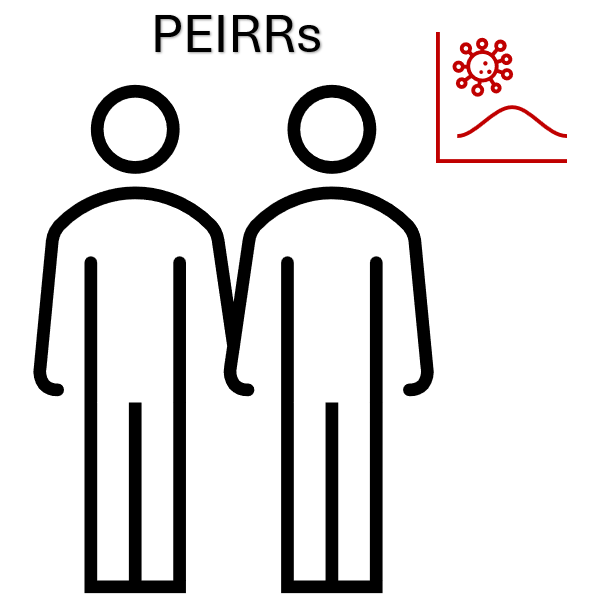

# Pair-based Estimators of Infection and Removal Rates

[](http://creativecommons.org/publicdomain/zero/1.0/)



## Install

Requires [`sdtemple/pblas`](https://github.com/sdtemple/pblas) as well.

```
devtools::install_github("sdtemple/pblas")
devtools::install_github("sdtemple/peirrs")
library(peirrs)
library(pblas)
```

## Requirements

This package has no dependencies on other packages. You likely can use any version of R 3+ or R 4+.

I developed the package with versions:
- R 4.1+

## Usage

Estimate infection and removal rates with partially observed removal and infection times. The following functions are the ones you would likely use, in order of relevance:
- Real data analysis
    - `peirr_tau()`
    - `peirr_bayes()`
    - `peirr_pbla_infection_rate()`
    - `peirr_bootstrap()`
- Simulation experiments
    - `simulator()`

All functions have docstrings. As a result, you can get help for instance with:
```
help(peirr_tau)
?peirr_tau
```

There are also functions with the suffixes `*_multitype()` and `*_spatial()` for estimators with multiple classes and spatial kernels, respectively.

The `peirr_bootstrap()` function does not provide confidence intervals but rather bootstrap samples. You can perform bias correction or interval estimation according to [Wikipedia](https://en.wikipedia.org/wiki/Bootstrapping_(statistics)#Deriving_confidence_intervals_from_the_bootstrap_distribution).

Some of the scripts for my analyses are under `scripts/`. These may provide examples of how to run the functions.

The function `tau_moment()` calculates the complicated equations derived in our paper. It is not meant for users but invoked in the estimator functions.